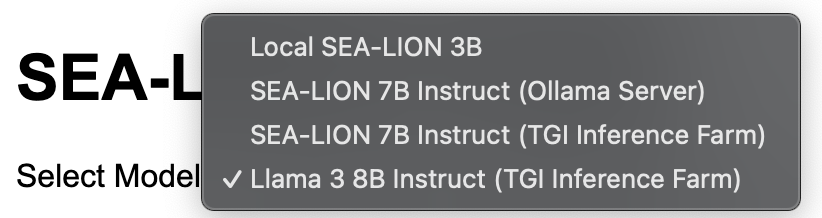
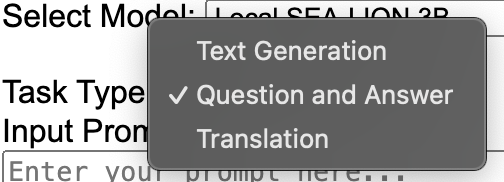
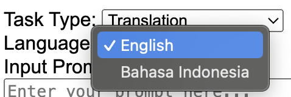

# Sea-Lion Base LLM Scripts

## Introduction
This repository contains basic scripts for running the Sea-Lion base LLM locally. It has been tested with the Sea-Lion-3b base LLM. The scripts available facilitate running prompts in the terminal, as well as running text completion, question and answer, and translation via a Flask app.

## Specifications
The scripts provided have been tested in the following environments:
### MacBook Pro
- Processor: 2.3GHz Quad-Core Intel Core i7
- Memory: 32GB
- OS: MacOS Sonoma version 14.5
- Chip Architecture: x86-64

### Debian GNU/Linux 11 (Bullseye) VM
- Memory: 16GB
- OS: Debian GNU/Linux 11 (Bullseye)
- Chip Architecture: x86-64

## Quick Startup

### Conda Installation
1. Download Miniconda from the [official website](https://docs.conda.io/en/latest/miniconda.html).
2. Follow the installation instructions for your operating system.

### Creation of Virtual Environment
Open your terminal and execute the following commands:
#### To create with `sealion_env.yml`
```sh
# Create a new conda environment
conda env create -f sealion_env.yml

# Activate the environment
conda activate sealion_env
```

#### To create with `requirements.txt`
```sh
# Create a new conda environment
conda create -n sealion_env python=3.12

# Activate the environment
conda activate sealion_env
```
Ensure you have requirements.txt in your project directory. Run:

```sh
# Install required packages
pip install -r requirements.txt
```
### Test prompt via script
To test the model with a simple prompt, run the following Python script via terminal:

```sh
python src.sealion_3b_prompt.py
```
It will prompt the model with the string `The sea lion is a` and should return a continuation of this sentence.

### Configuring Server Address/Model Names
Referring to `.env.example` as an example, create a `.env` file in the same repository folder. <br>
[Model Selection](#model-selection) section will advise on how to configure the variables used.
### Starting up the Flask App
To start up the Flask app:

```sh
flask -A src.sealion_3b_app run
```
To make the app accessible from other machines by exposing ports:
```sh
flask -A src.sealion_3b_app run --host '0.0.0.0'
```
<i>Note: Exposing your Flask app to '0.0.0.0' makes it accessible from any device on the network, which can introduce security risks. Ensure you have proper security measures in place.</i><br>

Alternatively: Running via Python script (Will run in debug mode and expose ports):
```sh
python src.sealion_3b_app.py
```
Once the terminal returns the following, you should proceed to access the app via [port 5000](http://127.0.0.1:5000):
```sh
 * Serving Flask app 'src.sealion_3b_app'
 * Debug mode: off
WARNING: This is a development server. Do not use it in a production deployment. Use a production WSGI server instead.
 * Running on http://127.0.0.1:5000
Press CTRL+C to quit
127.0.0.1 - - [DD/MMM/YYYY HH:MM:SS] "GET / HTTP/1.1" 200 -
```
### Running the Flask App
#### Model selection
<br>
There are 3 types of models made available for selection:
- <b>Locally run model</b>: Run directly from the Python script via HuggingFace Transformers, currently configured to run [`sea-lion-3b`](https://huggingface.co/aisingapore/sea-lion-3b) model under `LOCAL_MODEL` in `env.example`. Able to run on CPU.
- <b>Model on Ollama server</b>: This selection is configured to work with a model running on Ollama server. `OLL_API_URL` in `.env.example` is currently set to [default local address](https://github.com/ollama/ollama/blob/main/docs/api.md#request). `OLL_API_MODEL` should be set to the model name as per what was set in the Ollama [Modelfile](https://github.com/ollama/ollama/blob/0e4d653687f81db40622e287a846245b319f1fbe/docs/modelfile.md#basic-modelfile).
- <b>Multiple models on online server (TGI)</b>: This selection is configured to work with multiple models running on a TGI server with API Key authentication. `TGI_API_URL` should be set to the endpoint URL. `TGI_API_KEY` should be set to the API Key required, remove if no authentication used, it will default to `None`. Update the respective model names used in the server to `TGI_SEALION` and `TGI_LLAMA`. If only one model is used, remove `TGI_LLAMA`, it will default to `None`.

#### Task type selection
<br>
Currently there are three functions available, which prompt the base LLM differently:
- Text Generation: No additional template, LLM proceeds with text generation, continuing from where the input prompt ends. It should return the initial prompt with the generated text. Only for local model selection.
- Question and Answer: Prompt is input to a `Question: {prompt} Answer:` template
- Translation: An additional `Language` option will be provided (Default: `English`). Prompt is input to a `'{prompt}' In {language}, this translates to:` template. To date, performance is still sub-par and pending further experimentation. <br>



There are two parameters provided for the app user to toggle:
- Temperature (Default: `0.7`, Range:`0.0-1.0`): The value used to modulate the next token probabilities.
- Max New Tokens (Default: `40`): The maximum numbers of tokens to generate, ignoring the number of tokens in the prompt.

### For Further Exploration
To run the script for prompting via LangChain:

```sh
python src.sealion_3b_langchain.py
```
This script is currently a work in progress, with different parts commented out to test different ways of prompting the SEA-LION base model. Feel free to experiment with the script!