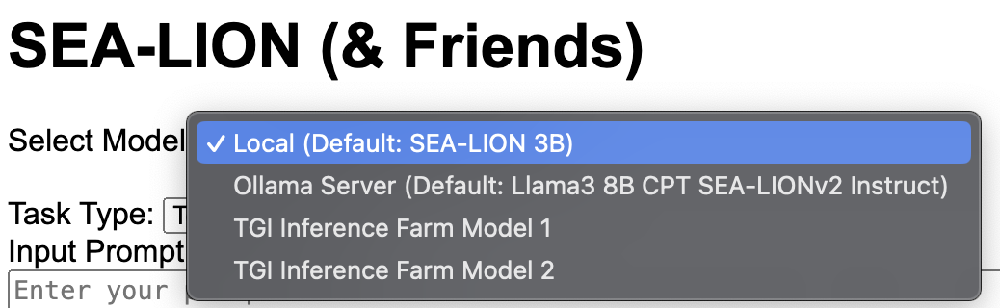

# SEA-LION Sampler App and Scripts

## Table of Contents
- [Introduction](#introduction)
- [Specifications](#specifications)
- [Quick Startup](#quick-startup)
    - [Conda Installation](#conda-installation)
    - [Creation of Virtual Environment](#creation-of-virtual-environment)
    - [Test prompt via script](#test-prompt-via-script)
    - [Configuring Server Address/Model Names](#configuring-server-addressmodel-names)
    - [Retrieving Ollama Model](#retrieving-ollama-model)
    - [Starting up the Flask App](#starting-up-the-flask-app)
    - [Running the Flask App](#running-the-flask-app)
- [For Further Exploration](#for-further-exploration)

## Introduction
This repository contains basic scripts for running the SEA-LION base LLM locally, as well as sending requests to the SEA-LION Instruct models running on Ollama/TGI servers. It has been tested with the [SEA-LION-3B](https://huggingface.co/aisingapore/sea-lion-3b) base LLM, as well as quantized GGUF files for 7b/[8b instruct models](https://huggingface.co/aisingapore/llama3-8b-cpt-sea-lionv2-instruct-gguf) on the server side. The scripts available facilitate running prompts in the terminal, as well as running text completion/input, question and answer, and translation via a Flask app.<br>

Do check out the range of SEA-LION models available at https://huggingface.co/aisingapore/<br>
Also available on Ollama at https://ollama.com/aisingapore

## Specifications
The scripts provided have been tested in the following environments:
### MacBook Pro
- Processor: Apple M3 Max
- Memory: 64GB
- OS: MacOS Sonoma version 14.5
- Chip Architecture: ARM64

### MacBook Pro
- Processor: 2.3GHz Quad-Core Intel Core i7
- Memory: 32GB
- OS: MacOS Sonoma version 14.5
- Chip Architecture: x86-64

### Debian GNU/Linux 11 (Bullseye) VM
- Memory: 16GB
- OS: Debian GNU/Linux 11 (Bullseye)
- Chip Architecture: x86-64

## Quick Startup

### Conda Installation
1. Download Miniconda from the [official website](https://docs.conda.io/en/latest/miniconda.html).
2. Follow the installation instructions for your operating system.

### Creation of Virtual Environment
Open your terminal and execute the following commands:
#### To create with `sealion_env.yml`
```sh
# Create a new conda environment
conda env create -f sealion_env.yml

# Activate the environment
conda activate sealion_env
```

#### To create with `requirements.txt`
```sh
# Create a new conda environment
conda create -n sealion_env python=3.12

# Activate the environment
conda activate sealion_env
```
Ensure you have requirements.txt in your project directory. Run:

```sh
# Install required packages
pip install -r requirements.txt
```
### Test prompt via script
To test the model with a simple prompt, run the following Python script via terminal:

```sh
python src.sealion_3b_prompt.py
```
It will prompt the model with the string `The sea lion is a` and should return a continuation of this sentence.

### Configuring Server Address/Model Names
Referring to `.env.example` as an example, create a `.env` file in the same repository folder. <br>
[Model Selection](#model-selection) section will advise on how to configure the variables used.
### Retrieving Ollama Model
Before running the Flask app, the model should be loaded on Ollama first.<br>
After [installation of Ollama](https://ollama.com/download), proceed to run the following command:
```sh
ollama pull aisingapore/llama3-8b-cpt-sea-lionv2-instruct
```
For specific quantizations, do add the available tag. For example:
```sh
ollama pull aisingapore/llama3-8b-cpt-sea-lionv2-instruct:q4_k_m
```
You should then see it when you run `ollama list`
```sh
ollama list
> NAME                                                    ID              SIZE    MODIFIED
> aisingapore/llama3-8b-cpt-sea-lionv2-instruct:latest    648d5f2d7bbe    4.9 GB  23 hours ago
> aisingapore/llama3-8b-cpt-sea-lionv2-instruct:q4_k_m    648d5f2d7bbe    4.9 GB  23 hours ago
```
Make sure the full model name is updated under `OLL_API_MODEL` in your `.env` file.
```
OLL_API_MODEL=aisingapore/llama3-8b-cpt-sea-lionv2-instruct
```
<i>Note: Ollama should be running before starting up the Flask app, if not the server would not be up. Running any of the commands should suffice in starting up Ollama, e.g. `ollama list`</i>

### Starting up the Flask App
To start up the Flask app:

```sh
flask -A src.sealion_app run
```
To make the app accessible from other machines by exposing ports:
```sh
flask -A src.sealion_app run --host '0.0.0.0'
```
<i>Note: Exposing your Flask app to '0.0.0.0' makes it accessible from any device on the network, which can introduce security risks. Ensure you have proper security measures in place.</i><br>

Alternatively: Running via Python script (Will run in debug mode and expose ports):
```sh
python src.sealion_app.py
```
Once the terminal returns the following, you should proceed to access the app via [port 5000](http://127.0.0.1:5000):
```sh
 * Serving Flask app 'src.sealion_app'
 * Debug mode: off
WARNING: This is a development server. Do not use it in a production deployment. Use a production WSGI server instead.
 * Running on http://127.0.0.1:5000
Press CTRL+C to quit
127.0.0.1 - - [DD/MMM/YYYY HH:MM:SS] "GET / HTTP/1.1" 200 -
```
#### Troubleshooting
In the event that the port is occupied, it may return such an error:
```
Address already in use
Port 5000 is in use by another program. Either identify and stop that program, or start the server with a different port.
On macOS, try disabling the 'AirPlay Receiver' service from System Preferences -> General -> AirDrop & Handoff.
```
Try assigning the Flask app to a different port instead:
```sh
flask -A src.sealion_app run --host '0.0.0.0' --port 5050
```
If running via Python script, do update the port (located at the end of script):
```python
if __name__ == "__main__":
    app.run(host="0.0.0.0", port=5050, debug=False)
```
### Running the Flask App
#### Model selection
<br>
There are 3 types of models made available for selection:
- <b>Locally run model</b>: Run directly from the Python script via HuggingFace Transformers, currently configured to run [`sea-lion-3b`](https://huggingface.co/aisingapore/sea-lion-3b) model under `LOCAL_MODEL` in `env.example`. Able to run on CPU.
- <b>Model on Ollama server</b>: This selection is configured to work with a model running on Ollama server. `OLL_API_URL` in `.env.example` is currently set to [default local address](https://github.com/ollama/ollama/blob/main/docs/api.md#request). `OLL_API_MODEL` should be set to the model name as per what was set in the Ollama [Modelfile](https://github.com/ollama/ollama/blob/0e4d653687f81db40622e287a846245b319f1fbe/docs/modelfile.md#basic-modelfile).
- <b>Multiple models on online server (TGI)</b>: This selection is configured to work with multiple models running on a TGI server with API Key authentication. `TGI_API_URL` should be set to the endpoint URL. `TGI_API_KEY` should be set to the API Key required, remove if no authentication used, it will default to `None`. Update the respective model names used in the server to `TGI_SEALION` and `TGI_LLAMA`. If only one model is used, remove `TGI_LLAMA`, it will default to `None`.

#### Task type selection
<br>
Currently there are three functions available, which prompt the base LLM differently:
- Text Generation/Input: No additional template, LLM proceeds with text generation, continuing from where the input prompt ends. For base models, it should return the initial prompt, continued with the generated text. For chat/instruct-tuned models, they should return a response to the prompt.
- Question and Answer: Prompt is input to a `Question: {prompt} Answer:` template
- Translation: An additional `Language` option will be provided (Default: `English`). Prompt is input to a `'{prompt}' In {language}, this translates to:` template. To date, performance is still sub-par and pending further experimentation. <br>


There are two parameters provided for the app user to toggle:
- Temperature (Default: `0.7`, Range:`0.0-1.0`): The value used to modulate the next token probabilities.
- Max New Tokens (Default: `40` for local, `128` for server): The maximum numbers of tokens to generate, also known as num_predict in some frameworks.

## For Further Exploration
To run the script for prompting via LangChain:

```sh
python src.sealion_3b_langchain.py
```
This script is currently a work in progress, with different parts commented out to test different ways of prompting the SEA-LION base model. Feel free to experiment with the script!